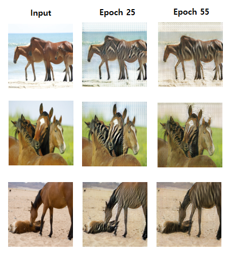

# Implementation of CycleGAN (with Skip Connection) in PyTorch

This is my own implementation of CycleGAN using PyTorch, introduced in [this paper](https://arxiv.org/pdf/1703.10593.pdf).
The main task was to carry out image-to-image translation from Horse to Zebra.

## Repository 

This repository contains:
* **CycleGAN.py** : Complete code for ALL steps of CycleGAN Implementation
* **visualize_test_images.py** : Code for genearating & visualizing new images using the test set, using the saved pre-trained parameters '~.pt' files 
					  
## Results

(some examples of the result)

## Datasets

Datasets necessary for CycleGAN projects can be downloaded from [this link](http://people.eecs.berkeley.edu/~taesung_park/CycleGAN/datasets/).

## List of Hyperparameters used:

* Batch Size = **1**
* Generated Image Size = **128 x 128**  
* Number of Filters in Discriminator's first hidden layer = **64**
* Number of Filters in Generator's first hidden layer = **64**
* Initial Learning Rate = **0.0002**
* Number of Epochs = **55**

## Sources

I referenced the following sources for building & debugging the final model :

* https://github.com/udacity/deep-learning-v2-pytorch
* https://www.cs.ru.nl/bachelors-theses/2018/Robin_Elbers___4225678___On_the_replication_of_CycleGAN.pdf
* https://github.com/leehomyc/cyclegan-1
* https://github.com/danieltan07/tensorflow-cycle-gan

